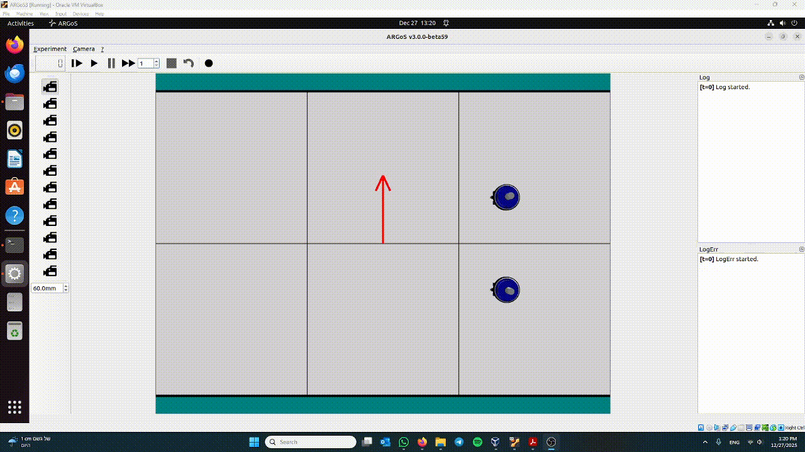

<p align="center">
  
</p>

# ARGoS-based Wind / Air Resistance (ARGoS 3)

This repository extends **ARGoS 3 (dynamics2d / Chipmunk)** with a **global wind model** and an **aerodynamic blocking / wake (shielding) effect** between robots. It provides ready-to-run examples and documentation so you can reproduce wind + wake behaviors in simulation for **e-puck2** and **foot-bot**.

---

## Quick demo (not an official example)
The animation above (`doc/media/demo.gif`) is a **quick demonstration clip**.  
It is **not** part of the official, reproducible examples under `examples/` (those are listed below).

**What you’re seeing**
- **Wind:** 270° (south), **5 cm/s**. The red arrow points **south**.
- **Controller:** Wind force is applied **in the controller** each tick (Qt loop-functions are used only for UI/labels/arrow).

**Robots**
- **Top robot (id=2)** – starts at y=+0.3, **facing north** at **5 cm/s**.  
  Wind is **5 cm/s south**, so the vectors cancel:  
  `v_net ≈ (0, +5) + (0, −5) = (0, 0)` → it stays essentially **in place**.
- **Bottom robot (id=1)** – starts at y=0.0, **facing east** at **5 cm/s**.  
  Wind pushes south at **5 cm/s**:  
  `v_net ≈ (+5, 0) + (0, −5) = (+5, −5)` → it moves **diagonally southeast** (forward + downward drift).

*Angle convention (ARGoS):* 0°=east, 90°=north, 180°=west, 270°=south.

---

## Project goal
Provide a clean ARGoS plugin + examples that:
- Adds a **global 2D wind vector** (direction + magnitude) to an experiment.
- Applies wind and drive as **post-step impulses** so physics/collisions remain authoritative.
- Implements **wake-based shielding** using **Range-and-Bearing (RAB)**, with smooth falloff to avoid jitter.
- Works for both **e-puck2 (single-body)** and **foot-bot (multi-body)** under ARGoS dynamics2d.

## Capabilities
- **Global wind** configured once per experiment:
  - `angle_deg` in ARGoS world degrees  
  - `magnitude` in **cm/s**
- **Impulse pipeline** per tick:
  - compute effective wind (possibly reduced by wake)
  - accumulate drive + wind impulses
  - apply once in a Chipmunk **post-step callback**
- **Blocking / wake model**
  - Upwind neighbors reduce effective wind smoothly (lateral Gaussian-like + downwind smoothstep fade)
  - “upwind gate” to avoid side-by-side false positives
  - robots share an effective body radius via **RAB byte[0]** for consistent geometry
- **Visualization**
  - Qt/OpenGL **wind arrow overlay** (direction + magnitude)

---

## Credit / provenance
This repository was built on top of an existing **ARGoS e-puck2 plugin skeleton**.

**Upstream repository:** `<https://gitlab.com/uniluxembourg/snt/pcog/adars/e-puck2/-/tree/main?ref_type=heads>`  


The upstream repository requests the following citation if the e-puck2 plug-in is used in research:

> D. H. Stolfi and G. Danoy, “Design and analysis of an E-Puck2 robot plug-in for the ARGoS simulator,” *Robotics and Autonomous Systems*, vol. 164, p. 104412, 2023. doi: 10.1016/j.robot.2023.104412.

### What changed and why
Compared to the upstream baseline, this project adds/changes:

1. **Global wind configuration**
   - Wind is defined once per experiment:
     ```xml
     <configuration>
       <air_resistance angle_deg="0" magnitude="15.0"/>
     </configuration>
     ```
   - Why: reproducible experiments + simple parameter sweeps.

2. **Impulse-based dynamics integration**
   - Wind and drive are applied as impulses via a **Chipmunk post-step callback**.
   - Why: collisions remain authoritative and the simulation remains stable.

3. **Aerodynamic blocking / wake using RAB**
   - Implemented smooth wake reduction from upwind neighbors (prevents flicker/jitter).
   - Why: enables “drafting/shielding” behaviors and swarm-like effects.

4. **Multi-robot support**
   - Supports **e-puck2** (single-body) and **foot-bot** (multi-body chassis).
   - Why: reuse across ARGoS robot types.

5. **Example derived controller (wind-aware)**
   - Demonstrates inheritance/extension for crosswind compensation (“crabbing”).
   - Why: shows how to extend the base air-resistance controller without rewriting the physics layer.

(Full architecture, equations, and pseudocode are in the manuals.)

---

## Controllers implemented / modified (explicit)
- **`air_resistance_controller`**  
  Base controller providing:
  - wind + drive impulse pipeline
  - RAB-based wake reduction / blocking

- **`wind_aware_air_resistance_controller`**  
  Derived/example controller demonstrating how to extend the base controller (used in the crosswind crab example).

---

## Official examples (reproducible)
All runnable experiments are under `examples/` and are documented in the **User Manual**.  
All GIFs shown below are stored in `doc/media/`.

### 1) Blocked vs Unblocked (3 e-puck2)
<p align="center">
  
</p>

**Shows:** A leader blocks wind; a follower in the wake moves upwind better than an offset robot.  
**Run:**
```bash
argos3 -c examples/airResistance_blocked_vs_unblocked.txt
````

### 2) Two Robots — No Blocking (parallel columns)

<p align="center">
  
</p>

**Shows:** Two e-puck2 spaced laterally; no wake overlap; both feel full wind.
**Run:**

```bash
argos3 -c examples/airResistance_two_no_block.txt
```

### 3) Two Robots with a Blocker (1 leader, 2 followers)

<p align="center">
  
</p>

**Shows:** One leader upwind; two followers within the wake core benefit from shielding.
**Run:**

```bash
argos3 -c examples/airResistance_two_with_block.txt
```

### 4) Three in a Row (wake chaining)

<p align="center">
  
</p>

**Shows:** Leader → follower → follower; wake fades downwind, so farther robots benefit less.
**Run:**

```bash
argos3 -c examples/airResistance_three_in_row.txt
```

### 5) Foot-bot Wake Demo (multi-body)

<p align="center">
  
</p>

**Shows:** Wake blocking with foot-bots (multi-body dynamics).
**Run:**

```bash
argos3 -c examples/airResistance_foot_bot_blocking.txt
```

### 6) Crosswind “Crab” Control (foot-bot)

<p align="center">
  
</p>

**Shows:** Crosswind compensation using the derived wind-aware controller.
**Run:**

```bash
argos3 -c examples/wind_crab_footbot.txt
```

---

## Configuration (quick reference)

### Global wind

```xml
<configuration>
  <air_resistance angle_deg="0" magnitude="15.0"/>
</configuration>
```

### Controller block (per robot)

```xml
<controllers>
  <air_resistance_controller id="airbot"
      library="build/lib/controllers/air_resistance/libair_resistance">
    <actuators>
      <differential_steering implementation="default"/>
      <range_and_bearing implementation="default"/>
    </actuators>
    <sensors>
      <positioning implementation="default"/>
      <range_and_bearing implementation="medium" medium="rab" show_rays="true"/>
    </sensors>
    <params velocity="15.0"/>
  </air_resistance_controller>
</controllers>
```

Units:

* `magnitude` (wind) is **cm/s**
* `velocity` (controller) is **cm/s**

---

# Compiling the code

Make sure you have **ARGoS >= 3.0.0-beta52** installed.

```bash
mkdir build
cd build
cmake -DCMAKE_BUILD_TYPE=Release ../src
make
sudo make install
```

If ARGoS does not find the new plugins, try:

```bash
cmake -DCMAKE_BUILD_TYPE=Release ../src -DCMAKE_INSTALL_PREFIX=/usr
```

Debug build:

```bash
cmake -DCMAKE_BUILD_TYPE=Debug ../src
```

---

# Documentation (PDFs) — where they come from + how to regenerate

## Where the PDFs come from

The PDFs are generated from LaTeX sources under `doc/docs/`:

* `doc/docs/ARGoS_based_Air_Resistance___User_Manual/main.tex`
* `doc/docs/ARGoS_based_Air_Resistance___developer_manual/main.tex`

The `doc/docs/Makefile` builds them and copies outputs into:

* `doc/docs/pdf/`

## Build the docs (Linux)

From `doc/docs`:

### 1) Install LaTeX build tools

This set matches what we needed to successfully build both manuals on Debian/Ubuntu:

```bash
sudo apt update
sudo apt install -y latexmk \
  texlive-latex-recommended texlive-latex-extra texlive-fonts-recommended \
  texlive-pictures texlive-science cm-super lmodern
```

### 2) Build both manuals

```bash
make docs
```

Outputs:

* `doc/docs/pdf/ARGoS_based_Air_Resistance__User_Manual.pdf`
* `doc/docs/pdf/ARGoS_based_Air_Resistance__developer_manual.pdf`

### 3) Clean doc build artifacts

```bash
make clean
```

## Troubleshooting doc builds

* **`latexmk: not found`**

  ```bash
  sudo apt install -y latexmk
  ```
* **`siunitx.sty not found`**

  ```bash
  sudo apt install -y texlive-science
  ```
* **`pdfTeX error (font expansion)`** (microtype/scalable fonts)

  ```bash
  sudo apt install -y cm-super lmodern
  ```

---

## Repo layout (where to look)

* `src/` — plugin/library source
* `controllers/` — controller implementations
* `loop_functions/` — wind parsing + visualization support
* `examples/` — runnable ARGoS experiments
* `doc/docs/` — LaTeX sources + Makefile to build manuals
* `doc/docs/pdf/` — generated PDFs (regenerate via `make docs`)
* `doc/media/` — GIFs used in this README


