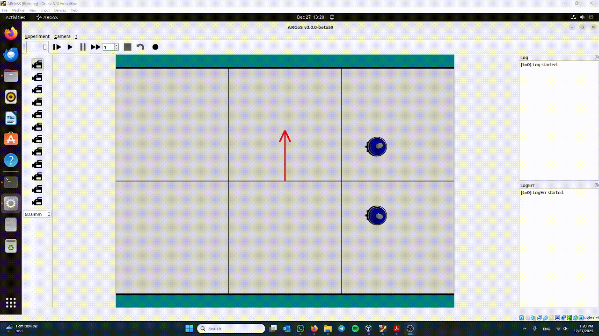

# ARGoS Wind / Air Resistance (with Wake / Blocking)

This project extends **ARGoS 3** with a practical wind + aerodynamic **wake / blocking** model that works with multiple robot types
(e.g., **e-puck2** and **foot-bot**) when using the **dynamics2d** physics engine (Chipmunk backend).

It provides:

- **Global wind** configured once per experiment (`<configuration><air_resistance .../>`)
- **Impulse-based physics integration** (wind + drive accumulated and applied **post-step**, after collisions)
- **Wake / blocking** (upwind robots reduce effective wind for downwind neighbors)
- **Robot-agnostic base controller** you can inherit from
- Optional **Qt-OpenGL wind arrow overlay**
- Full **User Manual + Developer Guide + Doxygen API docs**

---

## Quick demo (not an official example)

This is a short “what it looks like” preview.


The animation above (`doc/media/demo.gif`) is a quick demonstration clip.  
It is **not** part of the official, reproducible examples under `examples/` (those are listed below).

### What you’re seeing

- **Wind:** 270° (south), **5 cm/s**. The red arrow points south.
- **Controller/physics:** wind and drive are applied through this project’s impulse pipeline each tick.  
  Qt loop-functions are used only for UI/labels/arrow (visualization), not for the physics itself.

### Robots explained

- **Top robot (id=2)** — starts at *y = +0.3*, facing **north** at **5 cm/s**.  
  Wind is **5 cm/s south**, so the vectors cancel:

  `v_net ≈ (0, +5) + (0, −5) = (0, 0)` → it stays essentially in place.

- **Bottom robot (id=1)** — starts at *y = 0.0*, facing **east** at **5 cm/s**.  
  Wind pushes **south** at **5 cm/s**:

  `v_net ≈ (+5, 0) + (0, −5) = (+5, −5)` → it moves diagonally southeast (forward + downward drift).

### Angle convention (ARGoS)

`0° = east`, `90° = north`, `180° = west`, `270° = south`.

---

## Examples (official experiments)

Run experiments from the **repo root** (important for relative library paths):

```bash
argos3 -c examples/experiments/<file>.argos
````

### 1) Blocked vs Unblocked (3 e-puck2)

A leader blocks wind; follower in the wake progresses upwind; laterally offset robot does not.

```bash
argos3 -c examples/experiments/airResistance_blocked_vs_unblocked.argos
```


---

### 2) Two Robots — No Blocking (parallel columns)

Robots are laterally separated enough that wakes do not overlap; both see similar wind.

```bash
argos3 -c examples/experiments/airResistance_two_no_block.argos
```


---

### 3) Two Robots with a Blocker (1 leader, 2 followers)

Two followers behind a blocker benefit from partial shielding.

```bash
argos3 -c examples/experiments/airResistance_two_with_block.argos
```


---

### 4) Three in a Row (wake chaining)

Aligned robots show wake chaining: strong benefit close behind the blocker, weaker farther downwind.

```bash
argos3 -c examples/experiments/airResistance_three_in_row.argos
```


---

### 5) Foot-bot Wake Demo (multi-body)

Same wake mechanism using a multi-body robot model.

```bash
argos3 -c examples/experiments/airResistance_foot_bot_blocking.argos
```


---

### 6) Crosswind “Crab” Control (wind-aware example)

Shows a derived controller compensating crosswind (“crabbing”) vs the base behavior.

```bash
argos3 -c examples/experiments/wind_crab_footbot.argos
```



---

## Which controller should I use?

This repo provides one **base controller** and two **example derived controllers**.

* **`air_resistance_controller`** (base):
  Use this if you want to build your own behavior (navigation, formation, etc.) **while reusing wind + wake physics**.

* **`wind_aware_air_resistance_controller`** (example derived):
  Demonstrates how to **inherit** from the base and override logic to reduce crosswind drift (“crabbing”).

* **`formation_template_controller`** (example derived):
  Demonstrates how to inherit from the base while adding **multi-robot coordination logic** (template for formations, IDs, spacing, etc.).

> Important: If you want the robot to “drive” under this project’s physics model, you should use the base pipeline and call
> `DriveImpulse(...)` (or rely on the base controller’s call).
> Avoid directly forcing velocities (e.g. setting linear velocity) if you want consistent results with collisions + post-step impulses.

---

## Build

### Prerequisites

- **ARGoS 3** installed **with the `dynamics2d` physics engine available** (Chipmunk backend).
- Build tools: **CMake**, a C++17 compiler, and **make**/**ninja**.
- (Optional) For visualization: ARGoS **Qt-OpenGL** build/install (to see the wind arrow overlay).
- **Robot plugins** (depends on which experiments you run):
  - **foot-bot**: typically comes with standard ARGoS installs.
  - **e-puck2**: **must be installed separately** (this repo does **not** ship the upstream e-puck2 robot plugin code).  
    If you want to run the e-puck2 experiments under `examples/experiments/*.argos`, install the upstream e-puck2 plugin first (and make sure ARGoS can load it via install prefix or `ARGOS_PLUGIN_PATH`).

### Build everything (recommended)

This builds:
- the **base** controller + loop-functions
- the **example derived controllers** used by some experiments (`wind_aware`, `formation_template`)

From the repo root:

```bash
mkdir -p build
cmake -S . -B build -DBUILD_EXAMPLE_CONTROLLERS=ON
cmake --build build -j
````

Notes:

* You do **not** need `-DCMAKE_BUILD_TYPE=Release`: this project’s top-level `CMakeLists.txt` defaults to **Release** when not specified.
* If you want Debug explicitly:

```bash
cmake -S . -B build -DCMAKE_BUILD_TYPE=Debug -DBUILD_EXAMPLE_CONTROLLERS=ON
cmake --build build -j
```

* If you only want the **base plugins** (no example controllers):

```bash
cmake -S . -B build -DBUILD_EXAMPLE_CONTROLLERS=OFF
cmake --build build -j
```

## Configuration (wind + wake tunables)

Global wind (configured once per experiment under `<configuration>`):

```xml
<configuration>
  <air_resistance angle_deg="0" magnitude="15.0"/>
</configuration>
```

Optional wake / shielding tunables (all optional; defaults preserve behavior):

```xml
<configuration>
  <air_resistance
      angle_deg="0"
      magnitude="15.0"
      lateral_reach_radii="3.0"
      shadow_length_radii="4.0"
      gamma_boost="2.0"
      upwind_gate_radii="0.5"
      adv_radius_min_m="0.005"
      adv_radius_max_m="0.20"/>
</configuration>
```

Units (summary):

* `magnitude`: **cm/s**
* controller `velocity`: **cm/s**
* `*_radii`: **multipliers of robot radius** (dimensionless)
* `adv_radius_*_m`: **meters**

---

## Repository structure (where things live)

High-level layout:

```
src/
  controllers/
    air_resistance/              # Base controller (CAirResistance)
  loop_functions/
    wind_loop_functions/         # Wind global config + shared access
    wind_qt_user_functions/      # (Qt) draw wind arrow
examples/
  controllers/                   # Example derived controllers (optional build)
    wind_aware/
    formation_template/
  experiments/                   # Runnable .argos experiment configs
doc/
  Doxyfile                       # Doxygen config
  docs/                          # LaTeX manuals + Makefile targets
  media/                         # GIFs used in README/manuals
```

---

## Documentation

### Build PDFs (User Manual + Developer Guide)

From repo root:

```bash
cd doc/docs
make docs
```

This generates the PDFs under:

* `doc/docs/build/`

You can also build individually:

```bash
make user_manual
make developer_manual
```

### Doxygen (HTML API docs)

#### 1) Install dependencies (Ubuntu/Debian)

```bash
sudo apt-get update
sudo apt-get install -y doxygen graphviz
```

#### 2) Rebuild Doxygen HTML (from repo root)

```bash
cd doc
doxygen Doxyfile
```

#### 3) Open it

```bash
xdg-open doc/html/index.html
```

(Alternative wrapper target:)

```bash
cd doc/docs
make doxygen
```

---

## Provenance / Citation

This project was originally bootstrapped from the upstream e-puck2 ARGoS plugin skeleton.

If you use the e-puck2 plugin in research, please cite:

> D. H. Stolfi and G. Danoy, “Design and analysis of an E-Puck2 robot plug-in for the ARGoS simulator,” *Robotics and Autonomous Systems*, vol. 164, p. 104412, 2023. doi: 10.1016/j.robot.2023.104412.

---

## What this project adds (vs the upstream baseline)

This repository goes beyond the baseline by introducing **new functionality** rather than just reorganizing existing behavior:

* **A global wind configuration** (`<configuration><air_resistance .../>`) used consistently across an experiment
* A **post-step impulse pipeline** that applies wind + drive **after collisions** (Chipmunk post-step callback through dynamics2d)
* A **wake / blocking model** based on local neighborhood geometry (via RAB range/bearing), with smooth lateral + downwind falloff
* **Configurable wake tunables in XML** (width/length/boost/gate + advertised-radius sanity limits)
* A **robot-agnostic base controller** designed for subclassing (examples show how to extend it cleanly)
* Optional **Qt-OpenGL visualization overlay** (wind arrow)
* A full documentation set: **User Manual**, **Developer Guide**, and **Doxygen HTML**

---

## Troubleshooting

* **GIFs not showing on GitHub**: ensure links use `%20` for spaces (this README does).
  Better long-term: rename files to remove spaces.
* **Plugins not found**: run from repo root, or set:

  ```bash
  export ARGOS_PLUGIN_PATH="$PWD/build/lib:${ARGOS_PLUGIN_PATH}"
  ```
* **No wind effect**: ensure your experiment uses:

  ```xml
  <physics_engines>
    <dynamics2d id="dyn2d"/>
  </physics_engines>
  ```

---

## License

See the repository license (and upstream licensing where applicable).

